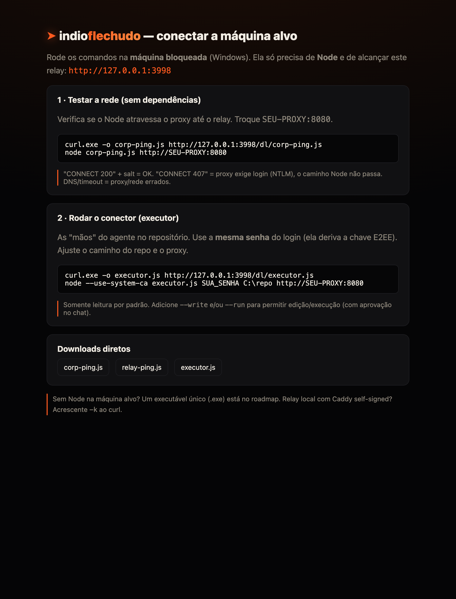

# Início rápido — indioflechudo

**2 máquinas, ~3 comandos.** Este guia leva um dev do zero a "conversando com o
Claude a partir de uma máquina bloqueada" no menor caminho possível.

---

## O que roda onde

```
  MÁQUINA A — seu Mac (tem o Claude)          MÁQUINA B — alvo (bloqueada/Windows)
  ────────────────────────────────           ──────────────────────────────────
   ┌───────────────────────────┐               ┌──────────────────────────────┐
   │ Docker: relay + Postgres  │◄──── E2EE ────►│ navegador → app (login+chat) │
   │ bridge  (Claude responde) │   (só cifrado)  │ executor (as "mãos" no repo) │
   │ mcp     (modo agente)     │                 └──────────────────────────────┘
   └───────────────────────────┘
        ▲  também dá para hospedar o relay no Fly (público, cego) em vez de local
```

- A **Máquina A** faz tudo que exige o Claude (bridge + mcp) e hospeda o relay
  (local via Docker, ou no Fly).
- A **Máquina B** só abre o relay no **navegador** e roda o **executor** (um
  arquivo único, sem npm) quando quiser o modo agente no código.

### Glossário (os nomes importam)

| Termo | O que é | Onde roda |
|-------|---------|-----------|
| **relay** | servidor cego (Express + Socket.io + Postgres); só vê ciphertext | Docker (Mac) ou Fly |
| **bridge** | worker que responde no chat via `claude -p` (auto-resposta) | Mac |
| **mcp** | expõe as ferramentas do agente ao Claude | Mac |
| **executor** (conector) | as "mãos" do agente: lê/edita/roda no repositório | Máquina alvo |

> ⚠️ **bridge ≠ executor.** O *bridge* é o cérebro no seu Mac; o *executor* são as
> mãos na máquina alvo. Os dois só se falam pelo relay, sempre cifrados.

---

## Máquina A (Mac) — 1 comando

Pré-requisitos: **Docker Desktop**, **Node 18+** e o **Claude Code** instalado e
autenticado (`claude`).

```bash
git clone https://github.com/gleidsonbalcazar/indioflechudo.git
cd indioflechudo
./up.sh
```

O `up.sh` (idempotente) faz tudo: valida os pré-requisitos, cria o `.env` com uma
**senha forte gerada**, instala as deps do host (bridge/mcp), sobe o relay
(Docker) já com os **bundles do conector**, liga o **bridge** como serviço
(reinicia sozinho) e imprime um **cartão** com a URL, a senha e o próximo passo.

Diagnóstico a qualquer momento:

```bash
./doctor.sh     # checklist verde/vermelho: Docker, relay, /dl, .env, Claude, bridge
```

---

## Máquina B (alvo bloqueada) — copiar e colar

A máquina alvo **já alcança o relay pelo navegador** (é assim que você usa o app).
Aproveite isso:

1. Abra o relay no navegador e vá em **`/onboard`**
   (ex.: `https://SEU-APP.fly.dev/onboard`).
2. A página mostra os comandos **já preenchidos** com a URL certa:
   - **testar a rede** (corp-ping, zero dependência);
   - **rodar o conector** (executor) — 1 comando.
3. Cole no terminal da máquina alvo. Só precisa de **Node** e da **mesma senha**
   do login (ela deriva a chave E2EE).



Para ativar o modo agente numa conversa, comece a mensagem com `/agente`.

---

## Se algo não conecta

| Sintoma | Provável causa | Ação |
|---------|----------------|------|
| `./doctor.sh` mostra `app` vermelho | Docker/relay não subiu | `./up.sh` de novo; ver `docker compose logs app` |
| Bridge não responde no chat | `claude` ausente/deslogado no Mac | `claude` no PATH e autenticado; `./up.sh` |
| `/dl/executor.js` indisponível | imagem sem os bundles | `docker compose build` (rebuild) |
| corp-ping mostra `CONNECT 407` | proxy corporativo exige login (NTLM) | caminho Node não passa — ver roadmap (.exe/.NET) |
| Aviso de cert no navegador (local) | Caddy usa cert self-signed | esperado em uso local; aceite o aviso |

Detalhes completos no **[README](./README.md)** e na arquitetura em
**[ARCHITECTURE.md](./ARCHITECTURE.md)**.
